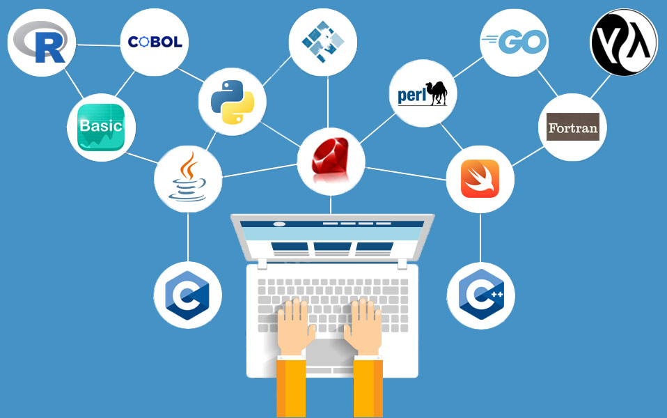

## Which programming language to choose?



This is often the first problem that stumbles most beginners as there are hundreds
if not thousands of programming languages out there. As for that, I propose two
ways that you can pick a programming language:

#### 1. Based on what your goal is

What do you want to do with programming? Making your own android app? A website?
Building a game? Different programming languages usually are better in some
of the fields than others. Therefore, if you have anything specific in mind,
you may consider following my list:

- **Creating a website**

To write a webpage, you must learn HTML and CSS at least. Then, you might want to
learn Javascript to add more functionalities to your webpage. For this, I
recommend starting with [Free Code Camp](freecodecamp.org/)'s
[Responsive Web Design Certification](https://www.freecodecamp.org/learn/responsive-web-design/).
Afterwards, you may want to learn Python if you want to build a fully functional
web application. This blog is made up of HTML, CSS and Javascript! (using jekyll)

- **Creating a computer/desktop application**

{% include image.html url="https://raw.githubusercontent.com/HohShenYien/Pomodoro-Timer/main/Preview/Preview%202.jpg" description="I made this app with C++" %}
To make an application for your computer, either Java, C++ or C# will be fine.
I personally recommend learning C++. C++ may be very difficult at start, but as you
become more familiar with this language, you'll be able to learn other programming
languages very quickly. C++ is great because of its versatility, and easy to make
apps using its Qt framework.

Java is used a lot for many people are using it (popular because popular) and has
a lot of documentation on it. If you're interested with Java instead, you can learn from
this book [Java: A Beginner's Guide](https://www.amazon.com/Java-Beginners-Eighth-Herbert-Schildt/dp/1260440214), which I learned a lot from it.
Meanwhile, C# is mainly for Windows application, I don't have much experience with it,
so yeah.

- **Analyzing data or Creating an AI**

Wants to make an AI chatbot? Wonders what is the [relationship between wealth and lifespan](https://www.theguardian.com/society/2020/jan/15/being-wealthy-adds-nine-years-to-life-expectancy-says-study)? Python is the best option for
you! I will be mentioning more about Python [below](#python).

- **Creating an app for your phone**

Interested to run a personal app in your Android phone? (Sorry, I have no experience in IOS)
Then perhaps you can look for Java or Kotlin. Personally, I think Java would be better
for beginner because there are a lot of resources online (see above on computer application part).

#### 2. My recommendation

Okay, cool, what if I have no idea on what I want to do with programming? Here are my
recommendations based on my past experience.

##### Python



I personally have started programming in Python with this amazing app [Sololearn](https://www.sololearn.com/). But why choose python? Here are the reasons:

1. Like English

   ```python
   print("Hello world")
   ```

   The simple short code shown above is how you want to display something in Python. Pretty neat,
   isn't it? The way how you write Python codes are very similar to English without too many strange
   symbols (at least at the start) that will confuse you.

2. No deep concepts

   Unlike other programming languages that will slam you with strange curly braces ({}) or strange
   keywords, Python is very direct, you write what you want to do. It's just easier for beginner
   to learn in my opinion.

3. Many tutorials available
    
    As [one of the most popular programming languages](https://www.northeastern.edu/graduate/blog/most-popular-programming-languages/), 
    it is needless to say how many tutorials are available out there. Beside [Sololearn](https://www.sololearn.com/), 
    you can easily find tonnes of tutorials out there especially from online learning platforms
    like [coursera](https://www.coursera.org/), [datacamp](https://learn.datacamp.com/), 
    [codecademy](https://www.codecademy.com/) and more!

Wow, that's nice, are there any drawbacks learning Python first?
1. Harder to learn other languages
    
    Due to how Python is different from other languages, you may experience difficulties
    when you want to learn languages like Java or C++. However, it'll still be easier 
    than learning from scratch. (this difficulty will disappear once you learn another
    language)

2. Vague Object Oriented Programming (OOP) concepts

    This is a slightly advanced concept that you'll only learn later. OOP is very useful
    and is widely used. However, this concept is not very direct in Python. It took me
    several months to comprehend this concept after feeling confident about Python basics.
    If you come to this point, I'd recommend you to learn OOP from Java and come back
    to Python afterwards.

So, in short, starting with Python is easy first, hard later. However, I believe that
starting easy is a very important factor to motivate people to learn programming.

##### C++
{% include image.html url="https://upload.wikimedia.org/wikipedia/commons/1/18/ISO_C%2B%2B_Logo.svg" description="" %}

If you don't mind difficulty or like challenges, you can try learning C++ first! After learning
it, I can promise to you that most other languages can be picked up easily. However, it might
be suffering when you learn C++ first. It is like the reverse of Python, bitter first, sweet later.

## Learn from where?

Another problem may be the vast amount of available platforms to learn them from.

Here are some of my recommendations:


- [Sololearn](https://www.sololearn.com/)

    Sololearn is especially suitable if you're learning on your phone. It has a very simple
    design that you can read and learn from it!


- [datacamp](https://learn.datacamp.com/) 
    
    Datacamp has one of the best courses out there. However, unless you have a student account,
    you have to pay to unlock all the courses (student account gives you 3 months free trial).
    It is better than sololearn as it provides videos and better programming problems. I 
    personally have took their Data Scientist Career Track with R previously and am very
    satisfied with their courses.


- [Freecodecamp](https://www.freecodecamp.org/learn)
    
    Freecodecamp's courses are free, and also has videos for their courses available in
    [youtube](https://www.youtube.com/c/Freecodecamp). However, it is mainly for web development
    and some Python courses. If you're interested in other languages you can only
    watch from their videos.

So which platform should I start learning?

- If you have a student account and are somehow interested in data analysis/statistics, I 
recommend you to start from datacamp. 
- If you are learning from phone, try sololearn.
- If you have a student account but not interested in data analysis, maybe you can try codecademy.
- Otherwise, try freecodecamp or coursera.

These are just my opinions, do share your opinions below too :)