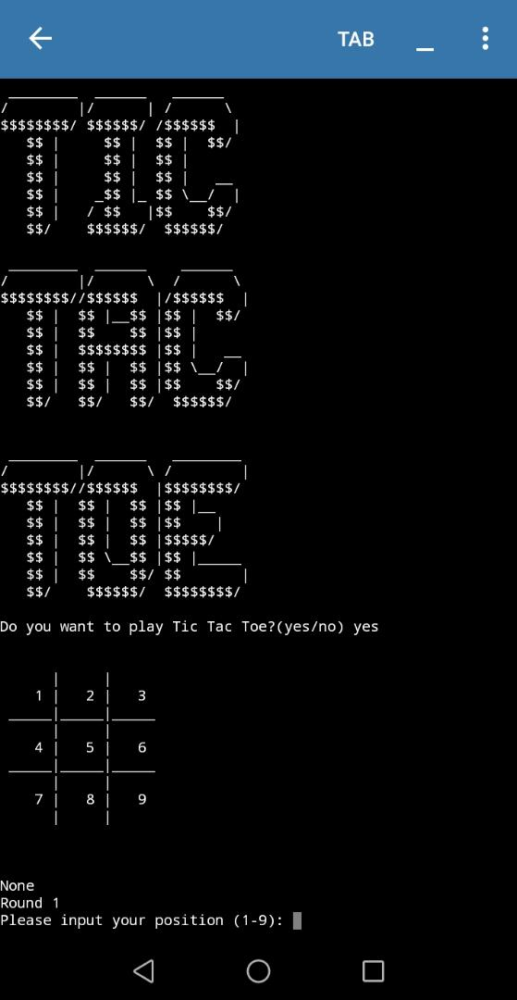

In my opinion, there are 3 phases in programming, i.e., beginner, intermediate and
advanced. In this post, I will be covering my journey through the first two 
phases.

## Beginner

{% include image.html url="../assets/img/posts/how-to-learn-programming/beginner.jpg" description="Starting out programming" width="70%" %}

This phase generally covers two parts for everyone who has just started programming.

### Starting Programming

To start programming, you should pick a new programming language to learn. You can refer to this 
[post](../2021-07-10-how-to-start-programming)
for my advice on picking a language to learn as well as some guides on where to learn them.

### After knowing the basics

It's kinda hard to define when you know the basics. But for me, I consider myself to know the basics
when I know the following:
- Printing hello world 
- Conditions (if else)
- Loops (for & while)
- Basic structures (array / list & dictionary if you're learning python)
- Functions

```python
# Python's way of printing hello world
print("Hello world")
```

```cpp
// C++ 's way of printing hello world
#include <iostream>

int main(void) {
    std::cout << "Hello world" << std::endl;
}
```

Okay cool, what's next? Clearly, there are still a lot of topics beyond these basics, including but not
limited to:
- Recursion
- Object Oriented Programming
- Functional Programming
- More data structures
- Algorithms
- Domain-specific knowledge (e.g. networking, data analytics, AI, web development)

and the list goes on...
<div class="text-center">
    <figure class="figure" style="margin-bottom: 0 !important;">
        
        <figcaption class="figure-caption text-center">My tic tac toe program created two years ago (running on pydroid), <a href='https://gist.github.com/HohShenYien/5295ad0e775637c144506d59164a4cf3'>source code</a></figcaption>
    </figure>
</div>

But before that, I do recommend beginners to do something simple! For instance, have you every tried 
writing a calculator app? Maybe a Black Jack app? Or even something slightly harder like tic tac toe, 
caesar cipher, pascal triangle! Remember one important thing, practice makes perfect. If you keep on
learning new concepts without applying them, you will not remember.

After you're more familiar of these concepts, I'd recommend you to follow the list above and you'll
eventually find your way out of beginner phase.

### Websites to practice

Here I'll include a list of websites which I find useful for beginners to practice programming skills on:
- [Project Euler](https://projecteuler.net/)

    This website mainly provides mathematical programming problems
- [Hackerrank](https://www.hackerrank.com/)

    There are a lot of programming problems in this website, ranging from easy to hard. Very suitable
    for general programming problems.

Those are the websites that I have experience before, but there are definitely more websites
that can provide programming problems! You can find more on this [Freecodecamp post](https://www.freecodecamp.org/news/the-10-most-popular-coding-challenge-websites-of-2016-fb8a5672d22f/).

## Intermediate



When do I think that I am at intermediate level? For me, when I feel like I'm at this level when 
I have:
- understood Object Oriented Programming (and implementing it)
- learned several differnt types of programming languages (object-oriented, functional, static-typed, dynamic-typed...)
- carried out several projects ([Some of my projects](../project))
- learned some algorithms (sorting, selection, trees...)

{% include image.html url="https://upload.wikimedia.org/wikipedia/commons/4/46/Dunning%E2%80%93Kruger_Effect_01.svg" description="Dunning–Kruger effect" width = "400px" %}

and most importantly, I feel more confident of my own programming skills! I believe you have already heard
of this [Dunning–Kruger effect](https://en.wikipedia.org/wiki/Dunning%E2%80%93Kruger_effect). So when I started
to feel confident again, I believe I'm on the right track of improvement and moving into improvement. 

### Characteristics

I find some specific characteristics in this phase:
- Gaining confidence
- Can learn other languages quickly (unless it's a language of another domain like Matlab, Prolog, Assembly)
- Learned some domain-specific knowledge 

### Improving

Currently, I find myself in this phase and some of the ways which I find improving the quickest are these:



1. Start a project

    When you do a project, it means that you're improving your skills and exploring more concepts.
    Of course, the question always boils down to what project?

    As for me, I always think that the best project would be a project that solves your own problem.
    For example, I created a desktop application, [Pomodoro Timer](../project#h2-1) because I needed
    a way to make sure I don't stare at screen for too long!

2. Read a book

    Regardless of what level you are, reading a book will always benefit you! At this point, beginner's
    books normally will give less benefit than a deeper book. In this context, I do have some recommendations
    too:
    - [CLRS' Introduction to Algorithm](https://www.amazon.com/Introduction-Algorithms-3rd-MIT-Press/dp/0262033844)

        This book has a good reputation in programming world (though its mathematics might be quite daunting).
        I personally have only read this book halfway, but I've already gained a lot of knowledge from it!
        An alternative to this book would be Sedgewick & Wayne's [Algorithms](https://algs4.cs.princeton.edu/home/).

    - [R bookdown](https://bookdown.org/)

        This is a website containing ebooks mainly for R created using markdown format. I find this website very
        friendly to everyone as its books are freely available! For me, I'll normally browse this 
        website when I am phone.

    - [Effective Software Development](https://www.amazon.com/gp/product/B08R2PKL9M?ref_=dbs_dp_rwt_sb_tpbk&binding=paperback)

        This is a series of books for effective programming. I've only read his Effective Python, and I
        find it very instructive.

{% include image.html url="../assets/img/posts/why-linux/tux.png" description="Linux" width="60%" %}

{:start="3"}
3. Use Linux

    Okay, I may be a little biased here (because I'm a proud Linux user). However, after using Linux,
    I feel a lot more confident to handle CLI and use various terminal commands. To me, to be a 
    good programmer, you should at least be able to handle the terminal. Besides, after using
    Linux, I become more familiar with various concepts like partitions, and get to use various
    built-in GNU tools like grep, less, cat, and not to mention pipe. More about the benefits
    of using Linux can be found in this [post](../2021-07-11-why-linux).

## Advanced

Well, I myself am not in this stage, so I'm not sure if my opinion is right or wrong. Nevertheless,
here are what I thought it'd be if I have entered advanced stage.

- Master at least one language

    To be advanced programmer, you should at least master one programming language.
    Mastering in a language is indeed a big word. I'm not even sure how great you have to be at the programming
    language to be consideredd as a 'master'. Nevertheless, I believe when you're there, you'll feel it.
    
- Has a niche domain

    There are many domains in programming like software development, webpage development, AI,
    data analysis and more. However, to be an advanced programmer, I think you should be
    particularly good in one (or more of course) domain. Subsequently, an advanced programmer should
    be an expert in the libraries related to the domain.

I didn't do put much too descriptions here because these are just my assumptions.

## Conclusion

These stages are all my opinions. They do not represent any facts nor standards. Actually, I believe
that you can actually feel where you are and how much you have progressed yourself without having
other people to tell you that. I hope that you can gain some insights from this post.
    